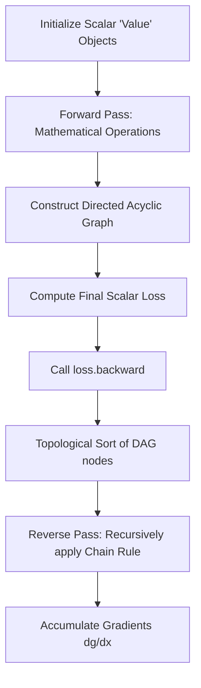
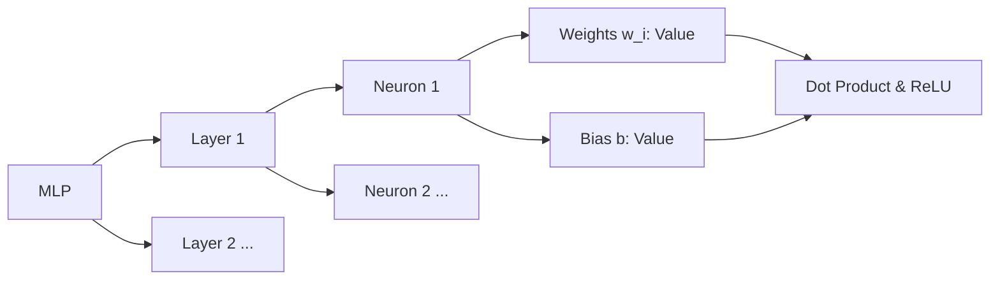

<div align="center">

# Micrograd


A tiny, transparent Autograd engine and neural network library implementing reverse-mode automatic differentiation over a dynamically built Directed Acyclic Graph (DAG) with a PyTorch-like API.


</div>

---

## Overview

Micrograd is a minimalist machine learning framework that implements backpropagation over a dynamically constructed DAG. Unlike modern production frameworks that operate on highly optimized multidimensional tensors, Micrograd operates strictly over **scalar values**. By chopping up every neuron into its individual, atomic additions and multiplications, the engine exposes the exact mathematical mechanics of gradient calculation and the chain rule. 

Built on top of this engine is a small, 50-line neural network library (`micrograd.nn`) that mirrors the standard PyTorch API. Despite its microscopic footprint (roughly 150 lines of code in total), the engine is fully capable of constructing, training, and optimizing deep neural networks for tasks like binary classification.

This repository is intended primarily for educational purposes—a glass-box implementation of the core algorithms powering modern deep learning.

### Key capabilities

- **Reverse-mode autodiff:** Full implementation of backpropagation for calculating gradients over arbitrary mathematical expressions.
- **Dynamic computation graph:** DAGs are built on the fly during the forward pass, meaning architectural changes require no static compilation.
- **PyTorch API parity:** The `nn` module implements familiar structures (`Neuron`, `Layer`, `MLP`) making transition to/from PyTorch seamless.
- **Granular tracing:** Ships with graphviz integration to visually trace the exact computational topology (data and gradients) of your networks.
- **Mathematically verified:** Unit tests calculate the exact same graphs in PyTorch to rigorously verify the correctness of all computed local and global gradients.

---

## Features

| Feature | Description |
|---|---|
| **Scalar Autograd Engine** | Tracks history, children, and local derivatives for every scalar operation to recursively apply the chain rule via topological sort. |
| **Micro NN Library** | High-level abstractions for defining multi-layer perceptrons (MLPs), complete with random weight initialization and parameter collection. |
| **Non-linearities** | Built-in support for activation functions like `ReLU` directly on the `Value` objects. |
| **Visual Tracing** | `trace_graph.ipynb` utilizes Graphviz to render visual node-and-edge graphs showing forward pass values and accumulated gradients. |
| **Stochastic Gradient Descent** | Capable of utilizing custom SVM "max-margin" or mean squared error loss functions optimized via SGD. |

---

## Architecture

### Computational Graph Pipeline



### Neural Network Hierarchy (`micrograd.nn`)



---

## Repository structure

```
micrograd/
├── micrograd/                     Core framework package
│   ├── engine.py                  The 'Value' scalar object and Autograd engine (~100 LOC)
│   └── nn.py                      Neural network modules: Neuron, Layer, MLP (~50 LOC)
├── tests/
│   └── test_engine.py             Unit tests verifying gradient correctness against PyTorch
├── demo.ipynb                     End-to-end 2-layer MLP training on the moon dataset
├── trace_graph.ipynb              Graphviz DAG visualization and rendering utilities
├── setup.py                       Package configuration
└── README.md                      Project documentation (this file)
```

---

## Engine Implementation

At the core of Micrograd is the `Value` object. When operations are performed on `Value` objects, the engine records the operation and the operands (children). When `.backward()` is called on the output node, the engine performs a topological sort to ensure nodes are processed in the exact reverse order of their creation, and applies the local derivative to accumulate the global gradient in the `.grad` attribute of every node.

### Supported Scalar Operations
The engine natively supports operator overloading in Python for the following operations, automatically calculating their local derivatives:
* **Addition / Subtraction:** `a + b`, `a - b`
* **Multiplication / Division:** `a * b`, `a / b`
* **Exponents:** `a ** k` (where `k` is a constant)
* **Activations:** `a.relu()`

---

## Installation

Install the package directly via pip:

```bash
pip install micrograd
```

To run the unit tests, you will also need to install [PyTorch](https://pytorch.org/), which serves as the oracle for verifying gradient accuracy:

```bash
pip install torch pytest
python -m pytest
```

---

## Usage

### Core Autograd Engine

Below is an example of building a complex computational graph, executing a forward pass, and backpropagating the gradients. 

```python
from micrograd.engine import Value

a = Value(-4.0)
b = Value(2.0)
c = a + b
d = a * b + b**3
c += c + 1
c += 1 + c + (-a)
d += d * 2 + (b + a).relu()
d += 3 * d + (b - a).relu()
e = c - d
f = e**2
g = f / 2.0
g += 10.0 / f

print(f'{g.data:.4f}') # prints 24.7041 (Forward pass outcome)
g.backward()
print(f'{a.grad:.4f}') # prints 138.8338 (dg/da)
print(f'{b.grad:.4f}') # prints 645.5773 (dg/db)
```

### Training a Neural Network

The `micrograd.nn` module makes it trivial to define complex networks. The `demo.ipynb` notebook provides a full example of training a 2-layer MLP (with two 16-node hidden layers) using a simple SVM "max-margin" binary classification loss and SGD.

After training on the classic `moon` dataset, the network successfully learns a non-linear decision boundary:


### Tracing and Visualization

For debugging and educational visualization, `trace_graph.ipynb` allows you to export the DAG to Graphviz. Calling `draw_dot(y)` on an output node generates a visual representation showing both the `.data` (left number) and `.grad` (right number) flowing through the mathematical operations.

```python
from micrograd import nn
# Instantiate a neuron with 2 inputs
n = nn.Neuron(2)
x = [Value(1.0), Value(-2.0)]
y = n(x)
dot = draw_dot(y)
```


---

# Author

**Ishank Mishra — AI/ML Developer**

[](https://linkedin.com/in/Ishank2301)
[](https://github.com/Ishank2301)
[](https://www.kaggle.com/ishank2905)
[](mailto:ishankmishra579@gmail.com)

---

<div align="center">

_If this project was useful, a ⭐ on the repository is appreciated._

</div>